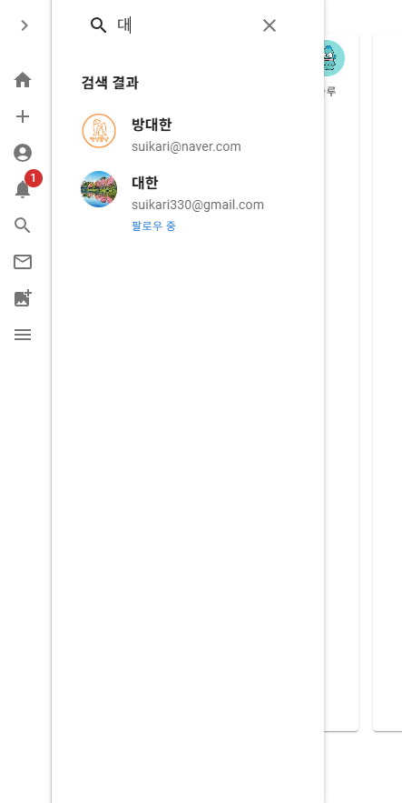

# SNS 웹 애플리케이션

이 프로젝트는 React, MUI, Node.js, Express, MySQL을 기반으로 구현된 SNS 플랫폼입니다.  
사용자는 피드를 작성하고, 댓글을 달며, 실시간 채팅 및 스토리 기능을 활용할 수 있습니다.  
심플하지만 확장 가능한 구조를 갖추고 있으며, UI/UX는 MUI를 기반으로 세련되게 디자인되었습니다.

---

## 개발 정보

- 개발 기간: 2025.05.07 ~ 2025.05.15  
- 개발 인원: 1인 개인 프로젝트  

---


## 기술 스택

| Frontend | Backend | Database | Etc |
|----------|---------|----------|------|
|  <br>  <br>  <br>  |  <br>  <br>  |  |  <br>  <br>  <br>  <br>  |

---


## 주요 기능

> 각 기능은 독립된 컴포넌트로 구현되어 있으며, 화면 예시는 아래와 같습니다.

### 피드 보기

타임라인 형식의 피드를 확인할 수 있으며 전체유저/팔로워/내글/언급(맨션) 글 순으로 볼수있게 되어있으며 (무한스크롤로 과도한 로딩 방지)  이미지, 댓글, 대댓글, 좋아요, 멘션, 태그 등을 지원합니다.


---


### 피드 작성 및 수정

이미지 업로드와 텍스트를 포함한 게시글을 작성할 수 있으며


피드 리스트에서 본인이 작성한 피드에 한해 수정, 삭제도 가능하게 설계되었습니다.


---

### 실시간 채팅

웹소켓(Socket.io 기반) 1:1 및 그룹 실시간 채팅 기능 .  
채팅리스트(무한스크롤로 과도한 로딩 방지) , 읽음 확인, 파일 전송, 메시지 삭제 등의 기능을 포함합니다.  


---


### 알림 시스템

좋아요, 댓글, 채팅, 맨션 등의 이벤트 발생 시 알림이 상단에 표시됩니다.  
실시간(api방식, 소켓x) 수신, 읽음 처리 기능 포함.  


---


### 사용자 검색

이름(닉네임)으로 사용자를 검색하고, 결과에 따라 프로필로 이동할 수 있습니다.  



---


### 스토리 보기

15초 자동 전환, 수동 탐색, 작성자 표시, 전체화면 모달 기반의 스토리 기능입니다.  


---


### 마이페이지

프로필 이미지, 닉네임, 자기소개 내용 변경, 내 피드 및 댓글, 좋아요, 스토리 조회 , 팔로우,팔로워,친구 등 유저 관련 기능 제공  


---


### 유저페이지

상대 프로필 이미지, 닉네임, 자기소개 , 피드 및 댓글, 좋아요, 팔로우,팔로워,친구 등 상대 유저 관련 정보 제공 페이지  


---


### 메뉴 , 그 밖에 기능

각 페이지를 열람가능한 메뉴 (크게,작게 토글 가능) , 서브메뉴 (로그아웃, 다크모드, 내 정보 등) 


친구 추천 시스템 ( 1순위. 친구의 친구 / 2순위. 랜덤 (5명까지)  )  모달창을 닫을 경우 우측하단에 버튼 표시 (버튼을 누르면 다시 모달창 열리는 구조)


---


### 로그인 , 회원가입 페이지

구글 API 연동을 포함한 로그인 페이지 (이메일 찾기, 비밀번호 찾기 구현 >> 비밀번호는 메일인증 )


회원가입 페이지 (API 연동의 경우 바로 회원등록 및 로그인 처리 , 회원가입은 메일 인증( 메일 인증 후 가입 가능 ))


---


## 프로젝트 구조

```
SNS-Project/
├── client/src             # React 프론트엔드
│   ├── components/
│   ├── pages/
│   ├── context/
│   ├── styles/
│   ├── utils/
│   └── ...
├── server/                # Express 백엔드
│   ├── controllers/
│   ├── routes/
│   ├── middlewares/
│   ├── sockets/
│   ├── uploads/
│   ├── utils/
│   ├── models/
│   └── ...
├── screenshots           
├── db_backup           
└── README.md
```

---

## 실행 방법

```bash
# 백엔드 실행
cd server
npm install
nodemon server.js

# 프론트엔드 실행
cd client
npm install
npm start
```

---
